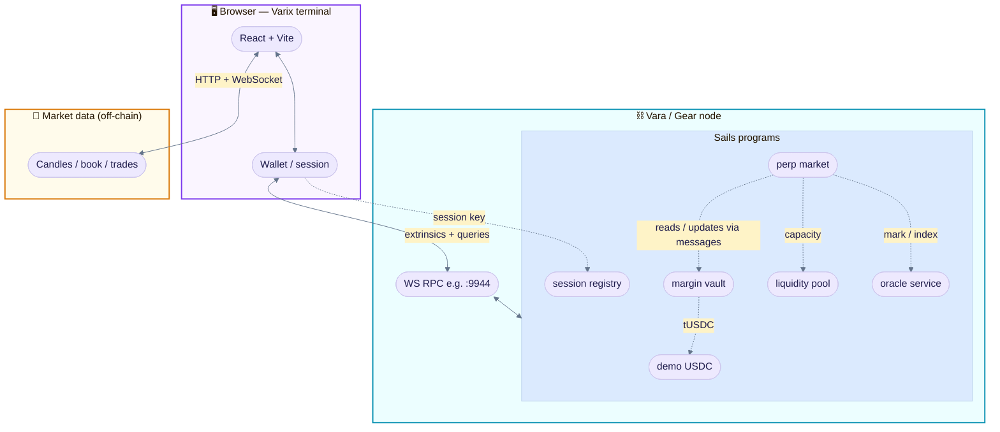
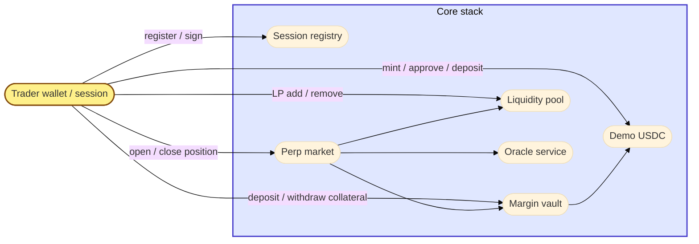
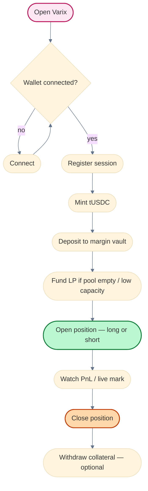
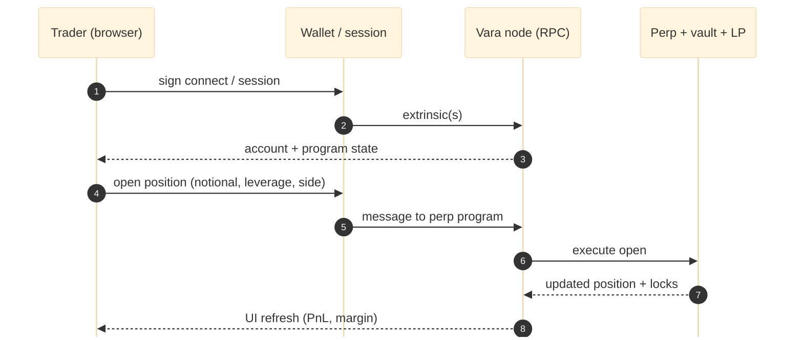

# Varix


**Perpetual futures on [Vara Network](https://vara.network/)** — isolated [Sails](https://github.com/gear-tech/sails) programs for collateral, liquidity, oracle quotes, and perp markets, plus a React trading terminal.

Execution and account state live **on-chain**. Chart, candles, and order-book depth are streamed from a **configurable** external market-data API (defaults use a public HTTP/WebSocket feed; see [Configuration](#configuration)).

---

## Table of contents

- [Architecture at a glance](#architecture-at-a-glance)
- [What you get](#what-you-get)
- [Prerequisites](#prerequisites)
- [Quick start: local Vara + web](#quick-start-local-vara--web-recommended-for-e2e)
- [Quick start: Docker Compose](#quick-start-docker-compose-full-service-stack)
- [Repository layout](#repository-layout)
- [Configuration](#configuration)
- [Scripts](#scripts-root-packagejson)
- [Contracts](#contracts)
- [User journey (whiteboard)](#user-journey-whiteboard)
- [Troubleshooting](#troubleshooting)
- [Documentation](#documentation)
- [Roadmap](#roadmap-high-level)
- [License](#license)

---

## Architecture at a glance

The diagram below is **[Mermaid](https://mermaid.js.org/)** (renders on GitHub and many IDEs). Layout uses rounded “bubbles” and soft curves so it reads more like a **whiteboard / Excalidraw sketch** than a rigid box diagram — edit in [Mermaid Live Editor](https://mermaid.live) if you want to tweak it.



**Contract dependency sketch** (who talks to whom on-chain — simplified):



---

## What you get

| Layer | Contents |
|--------|----------|
| **On-chain (Rust / Sails)** | Demo USDC (tUSDC), session registry, margin vault, liquidity pool, oracle service, isolated `perp-market` programs. |
| **Web (`web/`)** | Vite + React terminal: connect wallet, register session, mint / deposit / LP, open / close positions, live chart and book. |
| **UI runtimes** | **`vara`** — real wallet + Sails IDL when all required program IDs are set. **`demo`** — indexer-backed engine when IDs are missing (local loop without full deploy). |
| **Services (`services/`)** | Indexer, oracle relay, market-data proxy, liquidation watcher — see `docker-compose.yml`. |

---

## Prerequisites

| Tool | Notes |
|------|--------|
| **Node.js** | v20+ recommended; repo uses Corepack + **pnpm**. |
| **pnpm** | `corepack enable` then `pnpm install` at repo root. |
| **Rust** | For building contracts (`cargo`). |
| **Local Vara / Gear node** | Typical RPC: `ws://127.0.0.1:9944`. |
| **vara-wallet** | CLI for deploy script (`npm i -g vara-wallet` or `VARA_WALLET_BIN`). |
| **Docker** | Optional — Compose stack (PostgreSQL + services + built web). |

---

## Quick start: local Vara + web (recommended for E2E)

1. **Start** your local Vara/Gear dev node on `ws://127.0.0.1:9944` (or set `VARA_LOCAL_WS` when deploying).

2. **Install** dependencies:

   ```bash
   pnpm install
   ```

3. **Check** RPC:

   ```bash
   pnpm dev:check-vara
   ```

4. **Build** contract WASM artifacts (after contract changes):

   ```bash
   pnpm build:local-vara-contracts
   ```

5. **Deploy** programs and refresh `web/.env.local`:

   ```bash
   pnpm deploy:local-vara
   ```

   Uses `scripts/deploy-local-vara.cjs` with **`vara-wallet`** and seed `//Alice` by default (`VARA_LOCAL_SEED`).

6. **Run** the frontend:

   ```bash
   pnpm dev:web
   ```

7. **In the browser:** connect wallet → register session → mint tUSDC → deposit collateral → add LP if needed → open / close a position.

**Gas:** trades and deposits need native **VARA** for fees. On a local dev node the app may auto-fund from `//Alice`; if you see fee errors, use in-app **Fund gas** or fund the signing account manually.

**Market price:** local markets expect oracle/admin price updates aligned with your deploy; the UI can sync price around trade actions depending on configuration.

---

## Quick start: Docker Compose (full service stack)

Postgres + indexer + oracle relay + market-data proxy + built web:

```bash
docker compose up --build
```

Set `VARA_RPC_URL` and program env vars to match your chain. Compose does **not** start a Vara node — point RPC at testnet or a node you run.

---

## Repository layout

```text
contracts/     # Sails programs (demo-usdc-vft, session-registry, margin-vault, …)
services/      # indexer, oracle-relay, market-data-proxy, liquidation-watcher
web/           # React + Vite trading UI (@varix/web)
scripts/       # deploy-local-vara.cjs, RPC checks, helpers
docs/          # specs, plans, demo walkthrough
```

---

## Configuration

Copy `.env.example` to `.env` for service defaults. The **browser** reads **`web/.env.local`** (from `pnpm deploy:local-vara`) or `VITE_*` vars.

### Web (`web/` — Vite)

| Variable | Purpose |
|----------|---------|
| `VITE_NODE_ADDRESS` or `VITE_VARA_RPC_URL` | WebSocket RPC for Gear/Vara |
| `VITE_DEMO_USDC_PROGRAM_ID` | Demo USDC (tUSDC) |
| `VITE_SESSION_REGISTRY_PROGRAM_ID` | Session registry |
| `VITE_MARGIN_VAULT_PROGRAM_ID` | Margin vault |
| `VITE_LIQUIDITY_POOL_PROGRAM_ID` | Liquidity pool |
| `VITE_ORACLE_SERVICE_PROGRAM_ID` | Oracle service |
| `VITE_BTC_MARKET_PROGRAM_ID` (+ optional ETH/SOL) | Perp market programs |
| `VITE_SESSION_DURATION_BLOCKS` | Session lifetime (blocks) |
| `VITE_SESSION_FUNDING_AMOUNT` | Optional session-signer VARA hint |
| `VITE_INDEXER_*` / `VITE_MARKET_DATA_*` | Demo mode / proxy URLs |
| `VITE_HYPERLIQUID_INFO_URL` / `VITE_HYPERLIQUID_WS_URL` | Override default external market-data endpoints |

For **Vara mode**, all core program IDs plus **at least one** market ID must be set — see `web/src/lib/config.ts` (`getMissingVaraProgramEnvKeys`).

### Root / services

See `.env.example` for indexer ports, oracle keys, `ORACLE_SERVICE_PROGRAM_ID`, external feed URLs, and funding intervals.

---

## Scripts (root `package.json`)

| Command | Description |
|---------|-------------|
| `pnpm install` | Install workspace packages |
| `pnpm dev:web` | Vite dev server for `web/` |
| `pnpm dev:check-vara` | Sanity-check Vara RPC |
| `pnpm build:local-vara-contracts` | Build all local deploy contract targets |
| `pnpm deploy:local-vara` | Upload programs + refresh `web/.env.local` |
| `pnpm dev:indexer` / `dev:oracle` / `dev:data` / `dev:liq` | Individual services |
| `pnpm build` / `pnpm typecheck` / `pnpm test` | Workspace checks |

---

## Contracts

| Program | Role |
|---------|------|
| `demo-usdc-vft` | Mintable demo collateral (tUSDC) |
| `session-registry` | Delegated session keys (fewer wallet prompts) |
| `margin-vault` | Collateral deposit / withdraw / lock / release |
| `liquidity-pool` | LP shares and pool capacity for notionals |
| `oracle-service` | Relayer-verified price storage |
| `perp-market` | Isolated positions; open / close |

**Tests** (from repo root):

```bash
cargo test --manifest-path contracts/demo-usdc-vft/Cargo.toml
cargo test --manifest-path contracts/session-registry/Cargo.toml
cargo test --manifest-path contracts/margin-vault/Cargo.toml
cargo test --manifest-path contracts/liquidity-pool/Cargo.toml
cargo test --manifest-path contracts/oracle-service/Cargo.toml
cargo test --manifest-path contracts/perp-market/Cargo.toml
```

Other crates (`market-factory`, `funding-scheduler`, `liquidation-manager`, …) may be scaffolding — check each crate for maturity.

---

## User journey (whiteboard)

End-to-end **happy path** for a trader (conceptual — not every step is a single extrinsic):



**Sequence-style view** (who calls what — simplified):



---

## Troubleshooting

| Symptom | What to check |
|---------|----------------|
| UI stuck in **demo** mode | Missing `VITE_*` program IDs — run `pnpm deploy:local-vara` or fill `web/.env.local`. |
| `1010` fee errors | Native **VARA** on the **signing** account (wallet or session key). |
| `InvalidMargin` / pool errors | Collateral, LP capacity, order size; fund LP and keep notionals within limits. |
| `PositionAlreadyExists` | Current `perp-market` allows **one open position per trader per market** — close before opening another. |
| Chart / book empty | Network access to configured market-data URLs; VPN/firewall; optional `market-data-proxy`. |
| `ExternalIntegrationFailed` / dry-run panics | Often invalid state (no collateral, no LP, bad price) — UI guards reduce this; check logs and pool balances. |

---

## Documentation

- **[docs/demo-script.md](docs/demo-script.md)** — demo / recording walkthrough.
- **[docs/plans/](docs/plans/)** — architecture notes, specs, task breakdowns.

---

## Roadmap (high level)

Session UX (gas sponsorship / vouchers), richer position management (add size, flip side), factory-driven market deployment, and production-grade indexing aligned with chain events. Details in `docs/plans/`.

---

## License

License not specified in this repository; add a `LICENSE` file when you decide on terms.
