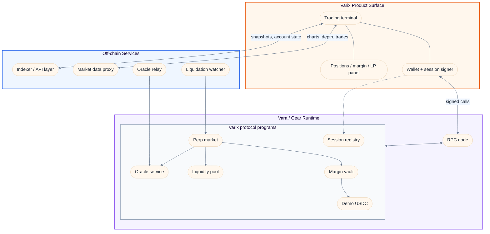
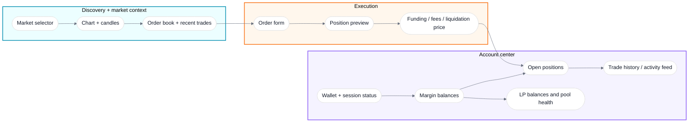
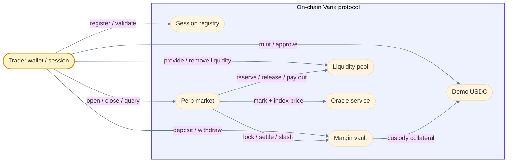
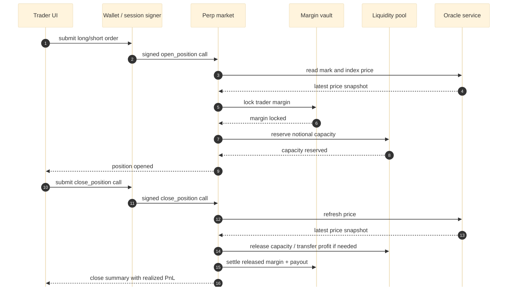
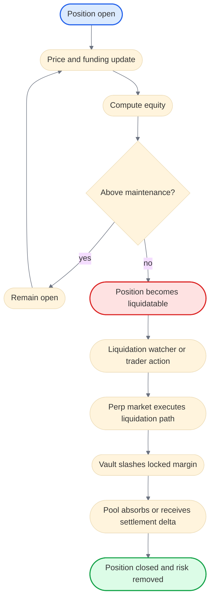
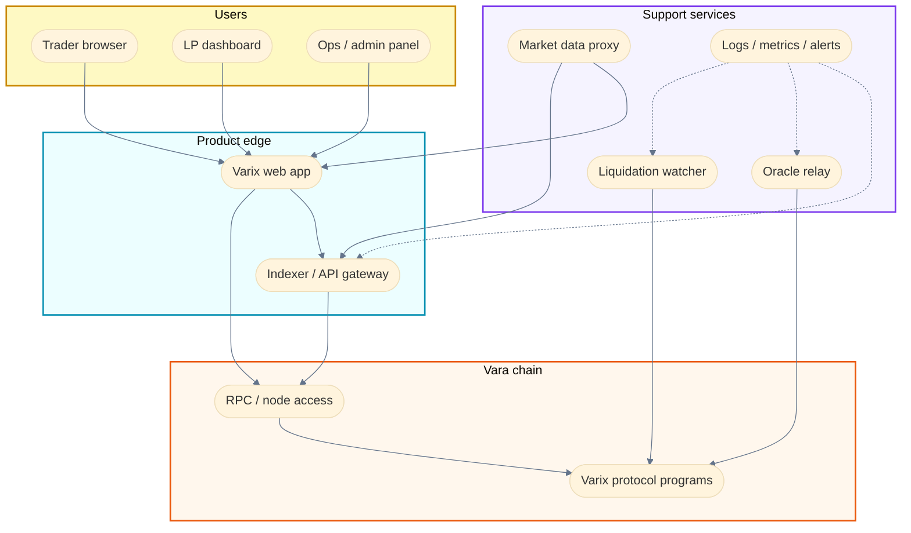

# Varix 

Perpetual futures protocol and trading terminal designed for **Vara Network**.


The product direction is simple:

- **Execution and account state on-chain**
- **Trading UX that feels centralized-exchange fast**
- **Composable protocol modules instead of one monolith**
- **A frontend that can grow from local dev mode into a production-grade trading app**

This repository already contains the core building blocks for that system:

- Rust + Sails contracts for collateral, oracle, liquidity, session keys, and isolated perp markets
- A React + Vite trading terminal
- Supporting services for price relays, market data, indexing, and liquidation monitoring
- Local deployment tooling for a Vara dev node

> **Important framing**
>
> This README is intentionally split into two views:
>
> - **Current repo status**: what is implemented in this repository today
> - **Target Varix**: what the fully developed production system is intended to look like
>
> That keeps the document aspirational without pretending unfinished pieces are already live.

---

## Table of Contents

- [What Varix Is](#what-varix-is)
- [Current Status vs Final Product Vision](#current-status-vs-final-product-vision)
- [Varix at a Glance](#varix-at-a-glance)
- [Target Product Surface](#target-product-surface)
- [Protocol Architecture](#protocol-architecture)
- [Trade Lifecycle](#trade-lifecycle)
- [Risk and Liquidation Flow](#risk-and-liquidation-flow)
- [Target Production Topology](#target-production-topology)
- [Repository Structure](#repository-structure)
- [Contracts](#contracts)
- [Services](#services)
- [Frontend](#frontend)
- [Quick Start](#quick-start)
- [Configuration](#configuration)
- [Testing](#testing)
- [Roadmap](#roadmap)
- [Documentation](#documentation)
- [License](#license)

---

## What Varix Is

Varix is built around the idea that a real on-chain perps venue should separate concerns cleanly:

- **Session registry** handles delegated session keys and lower-friction user actions.
- **Margin vault** owns collateral accounting.
- **Liquidity pool** owns deployable risk capacity and LP balances.
- **Oracle service** owns trusted price ingress.
- **Perp market** owns position state, PnL, funding, and liquidation checks.

That separation matters because it makes the system easier to reason about, test, upgrade, and eventually govern.

From a user perspective, Varix should feel like one product:

- connect wallet
- open a trading session
- mint or bridge collateral
- deposit margin
- open leveraged positions
- watch PnL update live
- close, settle, and withdraw

Under the hood, those actions are routed across multiple on-chain programs and off-chain support services.

---

## Current Status vs Final Product Vision

| Area | Current repo status | Target Varix |
|------|----------------------|--------------|
| **Core contracts** | Demo USDC, session registry, margin vault, liquidity pool, oracle service, and perp market are present | Hardened multi-market protocol with upgrade-safe rollout strategy |
| **Trading UX** | Browser terminal supports wallet, session, deposit, LP, and open/close flows | Full production terminal with portfolio, order history, funding panel, account analytics, and refined failure handling |
| **Market data** | Configurable external market data feeds and proxy exist | Resilient multi-source market data stack with monitoring and failover |
| **Execution model** | Isolated markets and contract-to-contract settlement are implemented | Mature risk engine, more position management paths, richer margin actions |
| **Operations** | Local dev deployment and Docker-based service stack exist | Production deployment topology with observability, indexing, alerting, and managed ops |
| **Protocol breadth** | One-repo prototype moving toward complete end-to-end flow | Final exchange-grade product experience on Vara |

---

## Varix at a Glance

The diagram below is intentionally styled to feel like a whiteboard or Excalidraw system map rather than a rigid infrastructure chart.



---

## Target Product Surface

This is the product-level picture for a fully developed Varix frontend: not just a demo shell, but a serious trading interface layered on top of the protocol.



**Target UX principles**

- The trader should always understand **position size, used margin, equity, funding, and liquidation risk** before clicking submit.
- The app should gracefully degrade between **fully on-chain Vara mode** and **local/demo mode** for development.
- The terminal should feel like one coherent product even though execution crosses several programs and services.

---

## Protocol Architecture

The next diagram focuses on protocol boundaries and message flow between programs.



### Contract responsibilities

| Contract | Responsibility |
|---------|----------------|
| `demo-usdc-vft` | Mintable demo collateral token used for local and dev flows |
| `session-registry` | Session authorization and session-key lifecycle |
| `margin-vault` | Free balance, locked balance, settlement release, withdrawal |
| `liquidity-pool` | LP deposit/withdraw, reserve tracking, risk capacity, payout routing |
| `oracle-service` | Trusted price updates used by market logic |
| `perp-market` | Position state, funding logic, realized PnL, liquidation conditions |

This modular split is the core architectural choice in Varix. The protocol is intentionally not a single giant contract.

---

## Trade Lifecycle

This diagram shows the intended end-to-end happy path for a real trading action.



### What this means operationally

- A trader action is not just a UI event. It is a cross-program settlement flow.
- The perp market should remain the **execution coordinator**, not the holder of all collateral.
- The vault and pool remain independently inspectable and testable.

---

## Risk and Liquidation Flow

Varix is not just about opening positions. The final product has to make risk state legible and enforceable.



For the product to feel professional, this risk engine must be visible in the frontend:

- liquidation threshold
- current margin ratio
- maintenance requirement
- funding impact
- likely close outcome before confirmation

---

## Target Production Topology

The diagram below is the **fully developed Varix operating model**, not just the minimal local-dev setup.



---

## Repository Structure

```text
contracts/   Sails programs and client bindings
services/    Indexer, oracle relay, market-data proxy, liquidation watcher
web/         React + Vite trading terminal
scripts/     Local deployment and environment helpers
docs/        Specs, plans, implementation notes, demo material
```

### Current repo maturity

- `demo-usdc-vft`, `session-registry`, `margin-vault`, `liquidity-pool`, `oracle-service`, and `perp-market` are the most relevant contract areas today.
- `market-factory`, `funding-scheduler`, and `liquidation-manager` exist as future-facing protocol scaffolding.
- The web app already has the right shape for a real product, even if some workflows are still in-progress or dev-oriented.

---

## Contracts

### Implemented protocol modules

| Path | Purpose |
|------|---------|
| `contracts/demo-usdc-vft` | Demo collateral token for dev and local testing |
| `contracts/session-registry` | Session-key authorization |
| `contracts/margin-vault` | Margin custody and settlement |
| `contracts/liquidity-pool` | LP capital and capacity management |
| `contracts/oracle-service` | Oracle update ingress |
| `contracts/perp-market` | Market execution, position logic, settlement |
| `contracts/shared` | Shared types and helpers |

### Future or control-plane areas

| Path | Purpose |
|------|---------|
| `contracts/market-factory` | Future market deployment orchestration |
| `contracts/funding-scheduler` | Future funding update coordination |
| `contracts/liquidation-manager` | Future liquidation control-plane logic |

---

## Services

| Service | Role |
|---------|------|
| `services/indexer` | Maintains off-chain state views and API-style access for the frontend |
| `services/oracle-relay` | Collects external price inputs and relays them on-chain |
| `services/market-data-proxy` | Provides candles, order book, trades, and external market context |
| `services/liquidation-watcher` | Watches stressed positions and can trigger liquidation flows |

The final product should rely on these services for **speed, visibility, and reliability**, while keeping execution-critical state on-chain.

---

## Frontend

The frontend lives in `web/` and is already structured around a real trading terminal:

- `App.tsx` drives the main workspace
- `components/` contains the terminal modules
- `hooks/` holds wallet, session, market, and data adapters
- `idl/` contains Sails program interfaces used by Vara mode
- `lib/config.ts` defines environment-driven runtime behavior

### UX goal

The end state is not a generic dashboard. It is a focused exchange terminal with:

- crisp market selection
- chart, order book, and recent trades
- margin-aware order entry
- wallet and session visibility
- position monitoring
- LP and collateral management

---

## Quick Start

### 1. Install dependencies

```bash
pnpm install
```

### 2. Start or point to a Vara node

For local development, use a node on:

```bash
ws://127.0.0.1:9944
```

You can sanity-check the HTTP RPC with:

```bash
pnpm dev:check-vara
```

### 3. Build local deploy contracts

```bash
pnpm build:local-vara-contracts
```

### 4. Deploy to local Vara and generate web config

```bash
pnpm deploy:local-vara
```

That script uploads the main protocol contracts and writes `web/.env.local`.

### 5. Run the frontend

```bash
pnpm dev:web
```

### 6. Typical local user flow

1. Connect wallet
2. Register a session
3. Mint demo USDC
4. Deposit collateral
5. Add LP capital if needed
6. Open a position
7. Monitor PnL and risk
8. Close and withdraw

### Optional full local stack

```bash
docker compose up --build
```

This runs the service-side stack, but it does **not** replace a Vara node.

---

## Configuration

Copy `.env.example` to `.env` for service defaults.

The web app reads runtime values from `web/.env.local` or `VITE_*` environment variables.

### Key frontend variables

| Variable | Purpose |
|---------|---------|
| `VITE_NODE_ADDRESS` / `VITE_VARA_RPC_URL` | Vara RPC endpoint |
| `VITE_DEMO_USDC_PROGRAM_ID` | Demo collateral token |
| `VITE_SESSION_REGISTRY_PROGRAM_ID` | Session registry contract |
| `VITE_MARGIN_VAULT_PROGRAM_ID` | Margin vault contract |
| `VITE_LIQUIDITY_POOL_PROGRAM_ID` | Liquidity pool contract |
| `VITE_ORACLE_SERVICE_PROGRAM_ID` | Oracle service contract |
| `VITE_BTC_MARKET_PROGRAM_ID` | BTC market contract |
| `VITE_ETH_MARKET_PROGRAM_ID` | ETH market contract |
| `VITE_SOL_MARKET_PROGRAM_ID` | SOL market contract |

### Important runtime rule

For **true Vara mode**, the app needs:

- the main core program IDs
- at least one market program ID
- a reachable Vara RPC endpoint

If those are missing, the frontend should fall back more gracefully to demo-oriented behavior.

---

## Testing

Contract suites can be run independently:

```bash
cargo test --manifest-path contracts/demo-usdc-vft/Cargo.toml
cargo test --manifest-path contracts/session-registry/Cargo.toml
cargo test --manifest-path contracts/margin-vault/Cargo.toml
cargo test --manifest-path contracts/liquidity-pool/Cargo.toml
cargo test --manifest-path contracts/oracle-service/Cargo.toml
cargo test --manifest-path contracts/perp-market/Cargo.toml
```

Web typecheck:

```bash
pnpm --filter @varix/web typecheck
```

If you add more local-node integration tests, keep them clearly separated from pure `gtest` coverage so the expected environment stays obvious.

---

## Roadmap

### Near-term

- tighten the current end-to-end Vara trading loop
- improve failure handling in the terminal
- expose clearer risk metrics in the UI
- extend tests around settlement and liquidation edge cases

### Mid-term

- richer position management
- multi-market orchestration
- better analytics and historical views
- cleaner operator tooling

### Final product direction

- exchange-grade trading UX
- clear portfolio and risk visibility
- reliable oracle and market data operations
- scalable indexing and monitoring
- governance-safe protocol evolution

---

## Documentation

- [docs/demo-script.md](docs/demo-script.md)
- [docs/plans/2026-04-19-varix-perps-architecture.md](docs/plans/2026-04-19-varix-perps-architecture.md)
- [docs/plans/2026-04-19-varix-perps-gtest.md](docs/plans/2026-04-19-varix-perps-gtest.md)
- [docs/plans/2026-04-19-varix-perps-spec.md](docs/plans/2026-04-19-varix-perps-spec.md)
- [docs/plans/2026-04-19-varix-perps-tasks.md](docs/plans/2026-04-19-varix-perps-tasks.md)
- [docs/plans/2026-04-20-varix-perps-implementation-correction.md](docs/plans/2026-04-20-varix-perps-implementation-correction.md)
- [docs/plans/2026-04-20-varix-session-architecture.md](docs/plans/2026-04-20-varix-session-architecture.md)
- [docs/plans/2026-04-20-varix-session-spec.md](docs/plans/2026-04-20-varix-session-spec.md)
- [docs/plans/2026-04-20-varix-session-tasks.md](docs/plans/2026-04-20-varix-session-tasks.md)
- [docs/plans/2026-04-22-varix-vft-perps-architecture.md](docs/plans/2026-04-22-varix-vft-perps-architecture.md)
- [docs/plans/2026-04-22-varix-vft-perps-spec.md](docs/plans/2026-04-22-varix-vft-perps-spec.md)
- [docs/plans/2026-04-22-varix-vft-perps-tasks.md](docs/plans/2026-04-22-varix-vft-perps-tasks.md)

---
